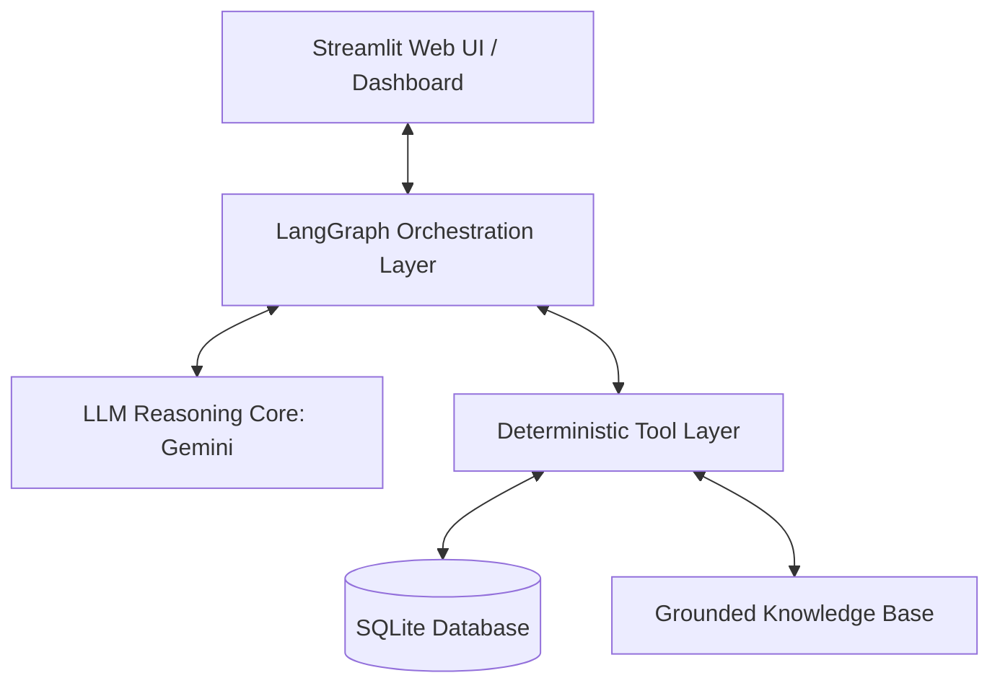
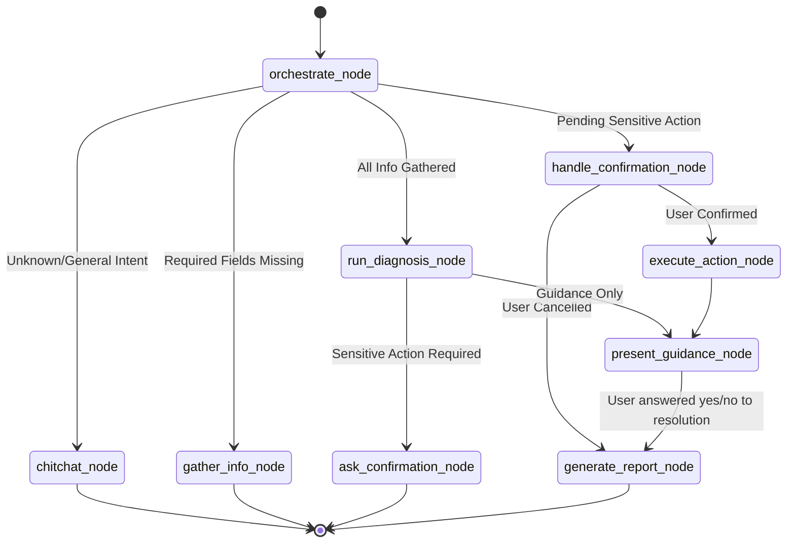

# HelpBot: IT Help-Desk Triage & Diagnostic Agent

HelpBot is a dockerised, domain-specific AI assistant designed to automate IT support triage, troubleshooting, and database action execution. Built on a modular architecture using **LangGraph** for orchestration, **SQLite** for structured persistent storage, and **Streamlit** for a premium glassmorphic user interface.

---

## 🚀 Quick Start (Single Command)

To start the application and all associated dependencies, ensure you have Docker installed and run:

```bash
docker compose up --build
```

The interface will be exposed locally at:
👉 **[http://localhost:8501](http://localhost:8501)**

### Configuration (`.env`)
Before running, copy `.env.example` to `.env` and configure your API key:
```env
GEMINI_API_KEY=your_gemini_api_key_here
DB_PATH=/app/data/helpdesk.db
```

---

## 📐 System Architecture

HelpBot implements a multi-layered production architecture:



1. **User Interface Layer**: Premium dark-mode Streamlit app (`HelpBot.py`) containing the interactive chat window, dynamic state inspector, diagnostic checklists, and database seeding controls.
2. **Orchestration Layer (`src/agent/graph.py`)**: A state machine governed by LangGraph. It directs conversational flow, parses intents, monitors missing fields, checks for user confirmation of state-changing actions, and handles termination.
3. **Reasoning Core (`src/agent/gemini_client.py`)**: Uses the Google GenAI SDK to interpret unstructured user inputs, extract parameters, and generate context-appropriate conversational steps.
4. **Tool Layer (`src/tools/helpdesk_tools.py`)**: Strongly typed functions for lookup, diagnostic verification, action execution, and report building.
5. **Data Layer (`src/db/database.py`)**: Persistent SQLite database storing users, devices, account security states, and support tickets.

---

## 🛠️ State Machine Diagram



---

## 📦 Database Schema & Domain Data

The SQLite database (`data/helpdesk.db`) consists of five primary tables structured to model an enterprise directory:

```sql
-- 1. Users table (Primary requesting entity)
CREATE TABLE users (
    username TEXT PRIMARY KEY,
    full_name TEXT NOT NULL,
    email TEXT NOT NULL UNIQUE,
    department TEXT NOT NULL
);

-- 2. Devices table (Associated workstation stats)
CREATE TABLE devices (
    device_id TEXT PRIMARY KEY,
    username TEXT NOT NULL,
    os TEXT NOT NULL,
    ip_address TEXT NOT NULL,
    vpn_configured INTEGER DEFAULT 0,
    last_patch_date TEXT NOT NULL,
    FOREIGN KEY (username) REFERENCES users(username) ON DELETE CASCADE
);

-- 3. Account Status (Security overrides)
CREATE TABLE account_status (
    username TEXT PRIMARY KEY,
    is_locked INTEGER DEFAULT 0,
    mfa_enabled INTEGER DEFAULT 0,
    mfa_method TEXT,
    password_expiry TEXT NOT NULL,
    FOREIGN KEY (username) REFERENCES users(username) ON DELETE CASCADE
);

-- 4. Knowledge Base (Troubleshooting steps for grounding)
CREATE TABLE knowledge_base (
    id INTEGER PRIMARY KEY AUTOINCREMENT,
    category TEXT NOT NULL,
    topic TEXT NOT NULL UNIQUE,
    symptoms TEXT NOT NULL,          -- JSON list of symptom phrases
    diagnostic_steps TEXT NOT NULL,  -- JSON list of diagnostic protocols
    resolution_steps TEXT NOT NULL,  -- JSON list of troubleshooting tips
    safety_warnings TEXT NOT NULL    -- Decision boundaries/warnings
);

-- 5. Incident Tickets (State-retaining action ledger)
CREATE TABLE tickets (
    ticket_id INTEGER PRIMARY KEY AUTOINCREMENT,
    username TEXT NOT NULL,
    device_id TEXT,
    category TEXT NOT NULL,
    symptoms TEXT NOT NULL,
    steps_taken TEXT NOT NULL,       -- JSON execution ledger of agent steps
    resolution_status TEXT NOT NULL CHECK(resolution_status IN ('Open', 'Resolved', 'Escalated')),
    created_at TEXT NOT NULL DEFAULT (datetime('now', 'localtime')),
    resolved_at TEXT,
    FOREIGN KEY (username) REFERENCES users(username),
    FOREIGN KEY (device_id) REFERENCES devices(device_id)
);
```

---

## 🧰 Implemented Tool Suite

HelpBot implements **five strongly typed domain tools**:

1. **`query_knowledge_base` (Information Tool)**: Deterministically queries matching troubleshooting topics, symptoms, diagnostic rules, and safety disclaimers.
2. **`lookup_user` (Information Tool)**: Fetches and validates requestor identity and their assigned hardware specifications.
3. **`analyze_diagnostic_input` (Analysis Tool)**: Validates ping packet loss statistics, analyzes Windows stop codes, and checks disk capacity.
4. **`execute_helpdesk_action` (Action Tool)**: Performs DB modifications including account unlocking (`is_locked = 0`), creating incident tickets, and updating status flags (Resolved/Escalated).
5. **`generate_resolution_report` (Reporting Tool)**: Generates a professional markdown summary outlining findings, diagnostic steps taken, resolution details, and safety disclaimer rules.

---

## 🛡️ Safety & Triage Controls

* **User Confirmation Gates**: State-changing operations (like unlocking an Active Directory account) are gated. The agent halts and prompts the user with security notifications. It executes only when the user confirms with "yes".
* **Clear Safety Warnings**: High-risk system crashes (like a Blue Screen) or update errors on critical infrastructure output explicit disclaimers fetched from the Knowledge Base (e.g. warning the user not to attempt internal hardware changes).
* **Deterministic Fallbacks**: If the agent's routing confidence falls below a set threshold, it redirects users safely without hallucinating fixes.
* **Runaway Loop Protection**: The graph enforces a hard limit of `MAX_ITERATIONS = 5` to stop infinite reasoning loops.

---

## 📊 Automated Evaluation Suite

HelpBot contains an **Evaluation Dashboard** to verify safety, conversation accuracy, and tool performance.

* **Where to find it**: Run the Docker stack and navigate to the **Evaluation** tab in the sidebar navigation page.
* **Test Isolation**: The test runner initializes and seeds the SQLite database to defaults before running, resets the DB before **each** of the 20 isolated conversation flows, and resets the DB again at completion.
* **Test Coverage**: Includes 20 distinct scripted test scenarios covering chitchat, missing parameter gathering, wrong credentials handling, account unlocks, network issues, safety disclaimers, and double-issue threads.
* **Exporting Results**: The dashboard provides a download button to export the full test suite outcome as a CSV sheet for reporting.
